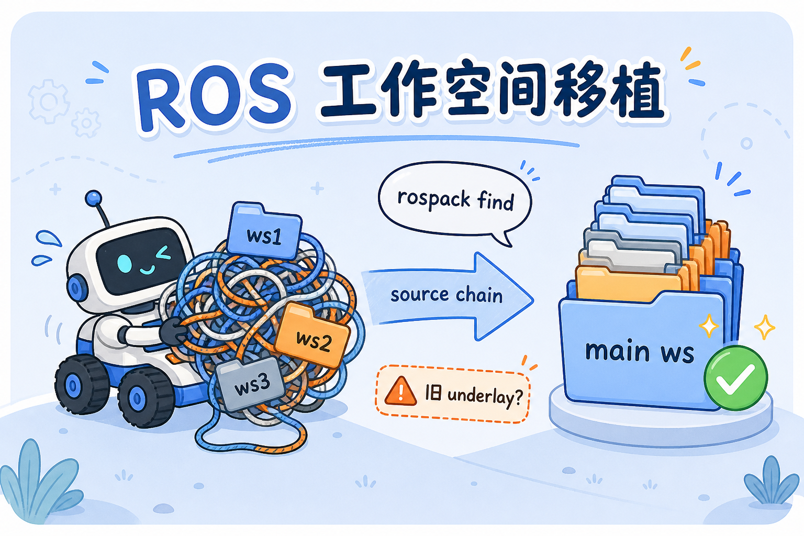

给 ROS 小车换机、换盘或「多车共用一套代码」时，最容易踩的坑不是 copy 文件，而是 **shell 里还留着旧工作空间的 source 链**。同一台机器上若叠了多个 catkin ws，甚至出现同名包，运行时到底用的是哪一份，往往要到报错时才暴露。

这篇是我整理、移植工作空间时的笔记：先搞清 catkin 怎么找包，再按顺序收敛 source，最后补上 udev 等硬件绑定。


{caption="多条混乱的 source 链收敛成一条干净的主工作空间"}

## 背景：为什么要整理 {#why}

典型场景：

- 一台小车上叠了 **主 ws + cartographer_ws + cv_bridge_ws** 等多个空间
- 不同目录里存在 **同名包**（例如多个 `mw_multi`）
- `.bashrc`、启动脚本、甚至某次 `export ROS_PACKAGE_PATH=...` 各写各的

如果不主动整理，会出现「编译过、launch 也能起，但跑的是旧包路径」的隐性问题。我的目标很简单：**只保留一条主 source 链，辅助 ws 按需 extend，并能用一条命令验证当前生效的包**。

## 先搞清：catkin 按什么顺序找包 {#lookup-order}

ROS Melodic + catkin 的 overlay 规则可以记成一句话：

**越晚 `source` 的工作空间，优先级越高。**

从低到高大致是：

```text
/opt/ros/melodic  →  先 source 的 ws  →  后 source 的 ws
```

因此移植前不必背所有路径，只要回答两个问题：

1. 当前任务依赖哪些包？
2. 这些包 **实际** 来自哪个 ws？

用下面命令查「此刻生效」的那份：

```bash
rospack find mw_multi
```

其中 `mw_multi` 换成你要确认的包名；输出路径就是 ROS 当前会用的那一份。

> [!NOTE] 建议
> 改 `.bashrc` 或脚本 **之前、之后各跑一次** `rospack find`，对比路径是否切到新 ws。

## 整理步骤 {#steps}

下面是我实际操作的顺序。前几步解决「显式 source」问题，第 4 步处理 catkin 编译时写进 setup 的「隐式 underlay」。

1. **收敛成一条主 source 链，辅助 ws 单独保留** — 主工作空间（例如整理后的 `1raicom_ws`）放整车代码；`cartographer_ws`、`cv_bridge_ws` 等若仍需要，作为 extend 链上的辅助 ws，不要和主 ws 混在同一层反复 source。做法：新建/指定一个主 ws，把要用的包归进去；在 `.bashrc` 里 **注释掉** 其它旧 ws 的 source，只保留新主 ws（及必要的 extend）。改完后 `rospack find` 验证关键包是否指向新路径。
1. **清掉 `ROS_PACKAGE_PATH` 的手工 prepend** — 仅注释 `source` 往往不够。若 shell 或脚本里有类似写法：
   ```bash
   export ROS_PACKAGE_PATH=/home/username/old_ws/src:$ROS_PACKAGE_PATH
   ```
   它会把 `old_ws/src` **插到最前面**，优先级甚至高于 catkin overlay，只影响执行过这条 export 的会话或从该会话启动的进程。这类行也要注释或删除。（路径中的 `username` 为占位，请换成你自己的家目录。）
1. **检查启动脚本里的 source** — `.bashrc` 改完还不够：比赛脚本、自写 launch 前 wrapper、`setup_env.sh` 等若仍 `source` 旧 ws，从脚本启动的节点仍会走旧链。把所有入口脚本过一遍，统一指向新 ws。
1. **排查其它 ws 是否仍链着旧 underlay** — 若只移植部分 ws、其余 ws 未动，要注意：`devel/setup.sh` 是 **编译时快照**。在哪个 shell 环境下 `catkin_make`，catkin 就把当时的 underlay 写进 setup；之后每次 `source .../devel/setup.bash --extend` 都可能把旧链带出来。可选做法：重写一个 `setup_env.sh`，显式定义 source 顺序；或在正确的 underlay 下 **重编** `cv_bridge_ws` 等辅助 ws。
1. **移植 udev 串口规则** — 换车或换 USB 口后，底盘、IMU、雷达等设备节点可能变。把 `config/udev/` 拷到新机器，按新车实际端口改规则并 reload。
{.steps}

> [!WARNING] 我踩过的坑
> 只改 `.bashrc` 后 `rospack find` 是对的，但用旧脚本 `rosrun` 仍报找不到包——原因是脚本里还有一次对旧 ws 的 `source`。入口脚本和交互 shell 要一起查。

## 移植后怎么确认「真的成功了」 {#verify}

| 检查项 | 怎么做 | 期望 |
| ------ | ------ | ---- |
| 包路径 | `rospack find <包名>` | 指向新 ws 下的路径 |
| 环境变量 | `echo $ROS_PACKAGE_PATH` | 无旧 ws 手工 prepend，或为空/符合预期 |
| 启动入口 | 搜 `.bashrc`、`.sh` 里的 `source` | 仅新 ws + 必要的 extend |
| 节点能否起 | `roslaunch` / 实车 prep | 无 `package not found`、无错包版本 |
| 硬件 | `ls -l /dev/carserial` 等 | udev 绑定正确 |

全部通过后，再考虑把旧 ws 目录归档或从机器上移除，避免以后误 source。

## 小结 {#summary}

工作空间移植的核心不是「文件拷过去」，而是 **让运行时只有一条可解释的 overlay 链**：主 ws 清晰、辅助 ws 按需 extend、没有残留的 `ROS_PACKAGE_PATH` 和编译快照里的旧 underlay。`rospack find` 是最便宜的回归测试；udev 则是换车时不该忘的硬件一步。

若你也在整理多台小车的 ROS 环境，欢迎对照上面的检查表逐项过一遍。
