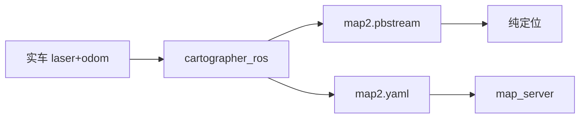

## 比赛使用的地图 {#maps}

| 文件 | 用途 |
| ---- | ---- |
| `data/maps/map2.yaml` | `map_server` 占用栅格 |
| `data/maps/map2.pbstream` | Cartographer 纯定位 |

两者须同一次建图产出；**换图后必须重测航点**（[`nav_competition.yaml`](https://github.com/RyanYhy/raicom2026/blob/main/src/raicom2026/param/nav_competition.yaml)）。

## 工具链 {#toolchain}

建图核心在 **外部** `~/cartographer_ws`；本仓库提供：

| 位置 | 内容 |
| ---- | ---- |
| `config/cartographer/` | lua 配置 |
| `scripts/save_map.sh` | 保存 yaml+pgm |
| `scripts/save_pbstream.sh` | 保存 pbstream |
| `test/launch/cartographer_localization.launch` | 调试纯定位 |

## 建图流程 {#pipeline}

1. 场地 Cartographer 在线建图
1. 保存 pbstream + yaml
1. 拷贝到 `raicom2026/data/maps/`
1. `mark_waypoint*.py` 标定航点
{.steps}

## 与比赛 launch 的关系 {#launch}

[`nav_competition_2026.launch`](https://github.com/RyanYhy/raicom2026/blob/main/src/raicom2026/launch/nav_competition_2026.launch) 默认：

- `map` → `map2.yaml`
- `pbstream` → `map2.pbstream`
- `loc_mode:=cartographer` 时 `cartographer_node` 读 pbstream
