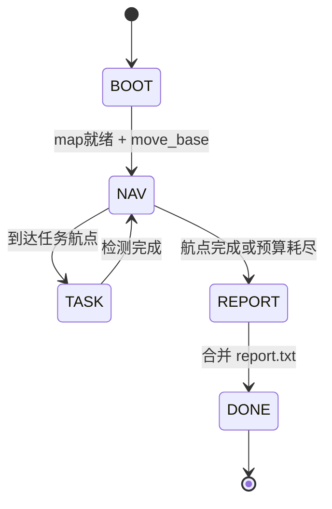

全国大学生机器人大赛（RAICOM）「智能侦察」赛项的整车 ROS 软件。小车在 5 分钟内自主穿越 A–D 四区，完成人物识别与水弹打靶、雷区计数、反坦克检测与避障，并输出 **6 行字节精确** 的 `report.txt`。

- **平台**：ROS Melodic · Ubuntu 18.04 · catkin 工作空间 `1raicom_ws`
- **仓库**：[raicom2026](https://github.com/RyanYhy/raicom2026)

## 系统在做什么 {#mission}

比赛任务可以概括为三条链路：

1. **导航** — 按预设航点巡航（`move_base` + Cartographer 定位）
1. **感知** — 到任务点触发视觉识别（人物 / 雷区 / 反坦克）
1. **输出** — 各任务写分报告，最后合并为 6 行 `report.txt`
{.steps}

启动分两段：**prep** 拉起全部传感器与模型；裁判计时后 **go** 只启动导航编排，秒级出发。

{caption="系统分层：由硬件到比赛任务"}

## 分层结构 {#layers}

| 层 | 内容 | 主要位置 |
| ---- | ---- | -------- |
| M1 硬件 | 麦克纳姆底盘、IMU、2D 雷达、云台枪、webcam、Orbbec | `config/udev/` |
| M2 驱动 | 串口/雷达/相机驱动，里程计 | `chassis_driver`、`imu_driver`、`leishen/`、`orbbec_camera` |
| M3 融合 | EKF：`odom_raw` + IMU → `/odom` | `robot_localization` |
| M4 模型 | URDF、静态 TF | `robot_description` |
| M5 定位导航 | 地图、Cartographer、`move_base` | `raicom2026/launch/`、`robot_navigation/` |
| M6 比赛任务 | 导航编排、视觉检测、报告 | `raicom2026/scripts/` |
| M7 运维 | prep/go、标定工具 | `scripts/`、`test/` |

## 总数据流 {#dataflow}

{caption="传感器 → 融合 → 定位 → 规划 → 底盘；nav 经 Service 触发视觉任务"}

**传感器 → 融合 → 定位 → 规划 → 底盘**

- 雷达 `/scan`、IMU、`odom_raw` 经 EKF 得到 `/odom`
- Cartographer 发布 `map → odom`
- `move_base` 输出 `/move_base/cmd_vel` → `cmd_vel_merge` → `/cmd_vel` → 底盘

**任务触发**（Service，非连续话题）：`nav_competition.py` 调用 `/person_detect_service`、`/mine_detect_service`、`/antitank_check_service`。

## 双相机分工 {#cameras}

| 相机 | 安装 | 模型 | 任务 |
| ---- | ---- | ---- | ---- |
| 云台 webcam | 随舵机转 | `person.onnx` | A–D 区人物识别 + 水弹打靶 |
| 云台 webcam | 同上 | `mine.onnx` | A/B 雷区计数 |
| Orbbec DCW2 | 车头固定 | `antitank.onnx` | 反坦克检测 → costmap 避障 |

## prep / go 两阶段 {#prep-go}

| 阶段 | 命令 | 做什么 |
| ---- | ---- | ------ |
| prep | `start_match_prep.sh` | 后台主 launch，起传感器/模型/定位/move_base |
| go | `start_match_go.sh` | 清空报告，仅起 `nav_competition.py` |

详见 [使用说明](../usage/)。

## 运行时状态 {#nav-state}

状态话题：`/nav_competition/state`（如 `NAV:P3`、`TASK:人物A`）。

## 相关页面 {#related}

- [使用说明](../usage/)
- [比赛任务](../module-tasks/)
- [附录：速查表](../appendix/)
