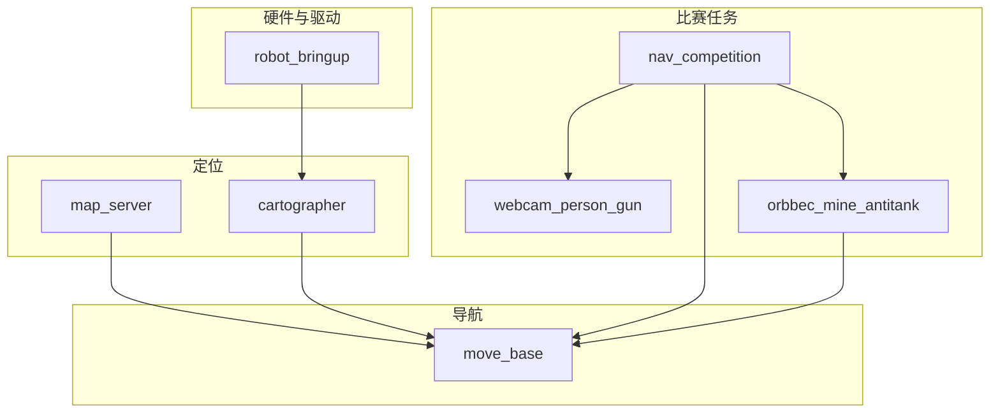

## 模块依赖 {#deps}

## 二次开发建议 {#dev-tips}

| 目标 | 建议 |
| ---- | ---- |
| 改航点/超时 | 只改 `nav_competition.yaml` |
| 改识别 | 对应 `scripts/*.py` + `data/models/*.onnx` |
| 改导航 | `robot_navigation/param/` + launch |
| 新功能 | **优先写在 `raicom2026` 包内** |

> [!TIP] Oink 与仓库
> 本文档站点用 [Oink](https://oink.pgsty.com/zh/book/) 主题组织内容；改代码以 [GitHub 仓库](https://github.com/RyanYhy/raicom2026) 为准。详见 [附录](../appendix/) 速查表。

## 关键入口 {#entry}

| 用途 | 路径 |
| ---- | ---- |
| 环境 | `scripts/setup_env.sh` |
| prep/go | `scripts/start_match_*.sh` |
| 主 launch | `launch/nav_competition_2026.launch` |
